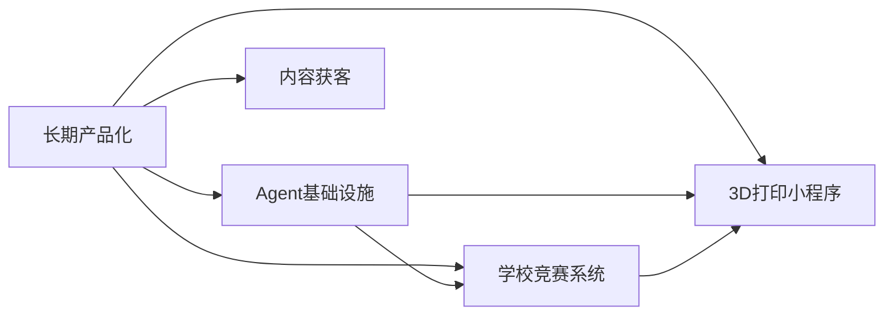

# 项目索引

> Migrated from the pre-rebuild vault after privacy filtering. Local paths and direct identifiers were redacted.

## Content

# 项目索引

> **最后更新**: 2026-05-01
> **来源**: AM 私密层分析提炼（去除隐私细节）

---

## P0 — 长期产品化主线

**状态**: 最高优先级，收束中  
**目标**: 从散项目转向可持续产品线  
**方向**: 中转站、网页卖功能、AI 工具服务、学校/企业场景

**关联项目**:
- 安全审计报告-2026-04-24 — 3D 打印设备管理
- 项目记录-2026-04-20 — 学校竞赛系统
- Coze复刻计划 — Coze 平台最小化全功能复刻
- Codex-开发项目索引-2026-04 — Codex April 开发项目索引

---

## P1 — Agent 自动化基础设施

**状态**: 长期基础设施，持续建设  
**目标**: 记忆库、工作流、模型路由、子代理、自动化脚本、本地工作台  
**关键资产**:
- Obsidian 知识库（当前 vault）
- Codex/Claude 多 Agent 编排
- ACP 协议
- 技能库（91+ 原子技能）

---

## P2 — 学校竞赛助手/服务系统

**状态**: 有学校支持，需产出可验收演示  
**目标**: 竞赛系统前端 + 后端服务  
**关联**:
- 项目记录-2026-04-20
- 报销材料、演示页、数据库/部署清单

---

## P3 — 3D 打印设备管理小程序

**状态**: 已收敛为最小闭环  
**目标**: 通电授权、费用记录、设备使用管理  
**已完成**:
- 小程序前端框架
- 后端 server.js + local-service.js
- 拓竹打印机 MQTT 控制链

**待修复**:
- 18 项安全审计发现（安全审计报告-2026-04-24）

---

## P4 — 内容获客与 AI 故事线

**状态**: 素材积累中，待转产品资产  
**目标**: 抖音/小红书/公众号内容、AI 生成视频、获客话术  
**策略**: 把素材转成 demo、脚本和可传播资产

---

## 项目关联图

---

## 关联

- 项目优先级栈-2026-05-01
- 当前状态总览
- Agent智能实体关系图谱

---

*来源: AM 私密层分析提炼*
