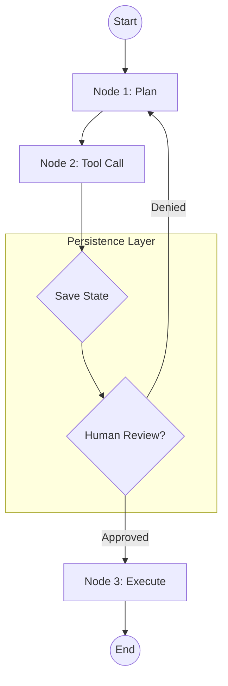

# LangGraph 深度内化: 确定性状态机与 HITL

> Migrated from the pre-rebuild vault after privacy filtering. Local paths and direct identifiers were redacted.

## Content

# 🏗️ LangGraph 深度内化: 确定性状态机与 HITL

> **核心理念**: **“确定性图论 (Deterministic Graph)”**。通过显式的状态管理和节点连接，解决 LLM 在复杂任务中的幻觉、死循环和状态丢失问题。

---

## 1. 🔍 核心技术架构

### 1.1 状态管理 (State Management)
- **共享状态 (Shared State)**: 节点间传递一个结构化的状态对象。所有节点都在操作这个单一的“事实来源”。
- **读写控制**: 严格控制节点对状态的修改权限，避免多并发冲突。

### 1.2 检查点与持久化 (Checkpointing)
- **实时快照**: 在每个节点执行后自动保存状态。
- **价值**: 
    - **崩溃恢复**: 执行失败后可从最后一个检查点恢复。
    - **分级会话**: 支持在同一图上运行多个独立的线程。

### 1.3 人类干预 (Human-in-the-Loop - HITL)
- **中断点 (Interrupt Points)**: 在执行高风险操作（如 `tools_call`）前强制暂停。
- **操作方式**: 
    - **Approval**: 允许/拒绝。
    - **Editing**: 修改 Agent 的计划或参数。
    - **Forking**: 从过去的检查点开始新的分支实验。

---

## 2. 📝 Mermaid 架构图 (Logic)

---

## 🚀 accio 演进启示
- **引入 `GlobalContext`**: 在 `aipy` 中实现类似的状态对象。
- **建立中断机制**: 在涉及本地磁盘写入或大额 API 消耗时，强制触发 `question` 供用户审核。
- **架构关联**: 查看该模式在本地技术拓扑中的演进逻辑：**技术栈关联矩阵**。

---
log:: 2026-04-10-详细行动存证
